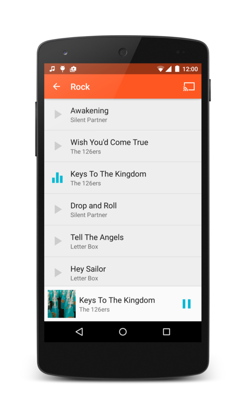
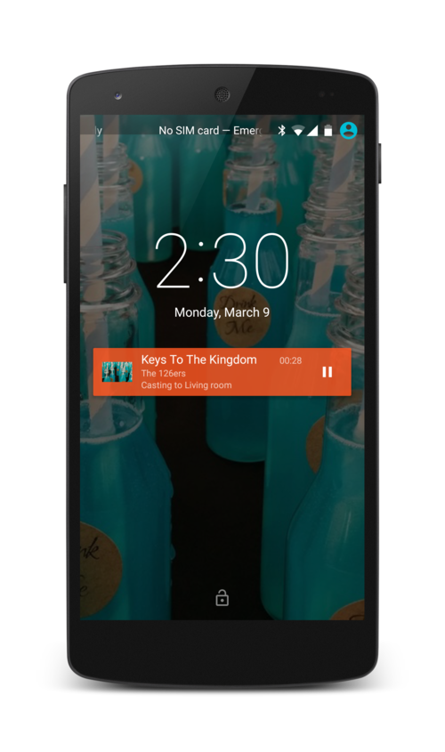
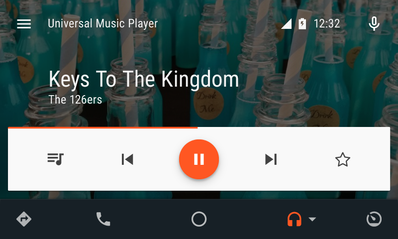
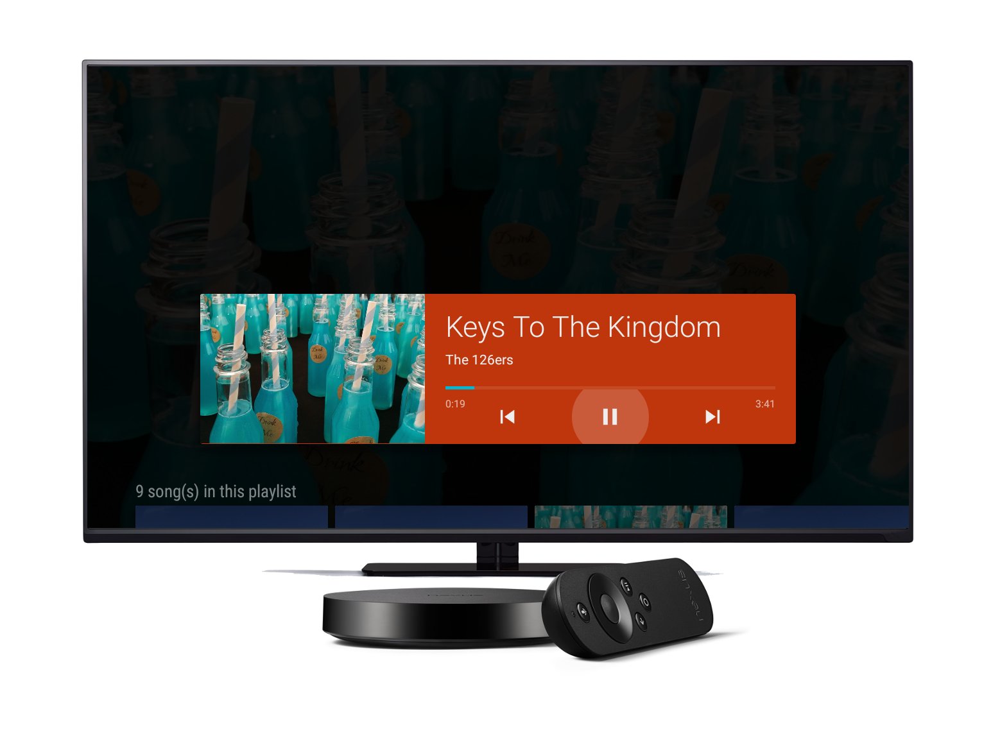
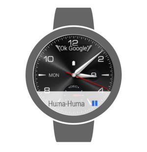

Universal Music Player sample  for Ceylon on Android
====================================================

This is a [Universal Music Player][1] sample application for Android,
ported to the [Ceylon language](https://ceylon-lang.org).

It demonstrates how to implement an audio media app that works
across multiple form factors and provide a consistent user experience
on Android phones, tablets, Android Auto, Android Wear, Android TV and
Google Cast devices.

It also demonstrates how to have an Android project containing a mix of
Ceylon code alongside Java code, using the [Ceylon Gradle plugin for Android][2].
(We've deliberately left some of the original Java code alone, in order to
demonstrate this.)

[1]: https://github.com/googlesamples/android-UniversalMusicPlayer
[2]: https://github.com/ceylon/ceylon-gradle-android

Pre-requisites
--------------

- Ceylon 1.3.3 (unreleased)
- Android SDK v25

Getting Started
---------------

The sample depends on a snapshot build of Ceylon 1.3.3. Edit
`mobile/build.gradle` to specify the `ceylonLocation` for Ceylon 1.3.3.

This sample uses the Gradle build system. To build the project, use the
`gradlew build` command or use 'Import Project' in Android Studio.

Screenshots
-----------

